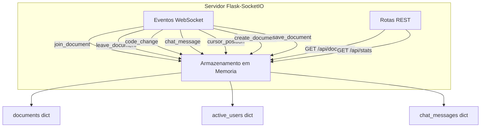
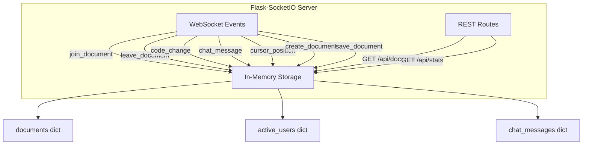

# Collaborative-Code-Editor

<div align="center">


</div>


[Portugues](#portugues) | [English](#english)

---

## Portugues

### Descricao

Backend de editor de codigo colaborativo em tempo real usando Flask-SocketIO com WebSocket para sincronizacao de documentos, chat e gerenciamento de usuarios.

**Nota: Este e um projeto somente backend.** Requer um cliente WebSocket (por exemplo, um frontend com Socket.IO client) para ser utilizado.

### O que faz

- Servidor WebSocket Flask-SocketIO com sincronizacao de documentos em tempo real
- Entrada e saida de salas (join/leave rooms) com broadcast de alteracoes de codigo
- Mensagens de chat por documento
- Rastreamento de presenca de usuarios e posicao do cursor
- Versionamento de documentos (em memoria)
- Endpoints REST para listagem de documentos e estatisticas do servidor

### O que NAO possui

- Interface de editor frontend (sem CodeMirror, Monaco ou Ace)
- Persistencia em banco de dados (armazenamento somente em memoria)
- Autenticacao ou autorizacao
- Escalabilidade horizontal (estado em processo unico)
- Testes automatizados

### Tecnologias

| Tecnologia | Papel |
|---|---|
| Python | Linguagem principal |
| Flask | Framework web |
| Flask-SocketIO | Comunicacao WebSocket em tempo real |

### Arquitetura



### Como executar

```bash
pip install -r requirements.txt
python app.py
```

O servidor inicia em `http://localhost:5000`.

### Estrutura do Projeto

```
Collaborative-Code-Editor/
├── app.py             # Servidor Flask-SocketIO (backend principal)
├── requirements.txt   # Dependencias Python
├── .gitignore
├── LICENSE
└── README.md
```

### Testes

Nenhum teste automatizado atualmente.

---

## English

### Description

Real-time collaborative code editor backend using Flask-SocketIO with WebSocket for document synchronization, chat, and user management.

**Note: This is a backend-only project.** It requires a WebSocket client (e.g., a frontend with Socket.IO client) to use.

### What it does

- Flask-SocketIO WebSocket server with real-time document synchronization
- Join/leave rooms with code change broadcasting
- Per-document chat messaging
- User presence tracking and cursor position
- Document versioning (in-memory)
- REST endpoints for document listing and server statistics

### What it does NOT have

- Frontend editor UI (no CodeMirror, Monaco, or Ace)
- Database persistence (in-memory storage only)
- Authentication or authorization
- Horizontal scaling (single-process state)
- Automated tests

### Technologies

| Technology | Role |
|---|---|
| Python | Core language |
| Flask | Web framework |
| Flask-SocketIO | Real-time WebSocket communication |

### Architecture



### How to run

```bash
pip install -r requirements.txt
python app.py
```

The server starts at `http://localhost:5000`.

### Project Structure

```
Collaborative-Code-Editor/
├── app.py             # Flask-SocketIO server (main backend)
├── requirements.txt   # Python dependencies
├── .gitignore
├── LICENSE
└── README.md
```

### Tests

No automated tests currently.

---

## Licenca / License

MIT - see [LICENSE](LICENSE).
